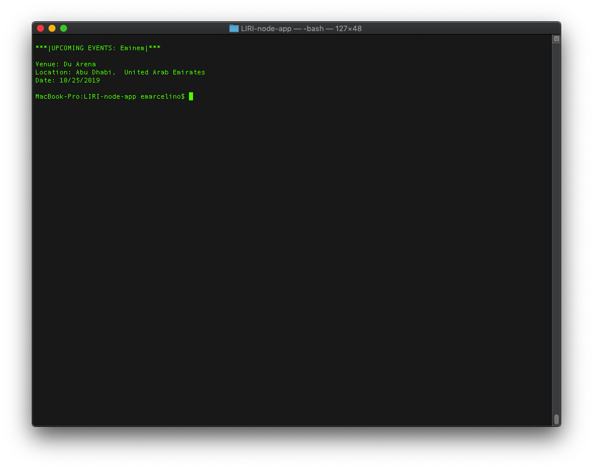
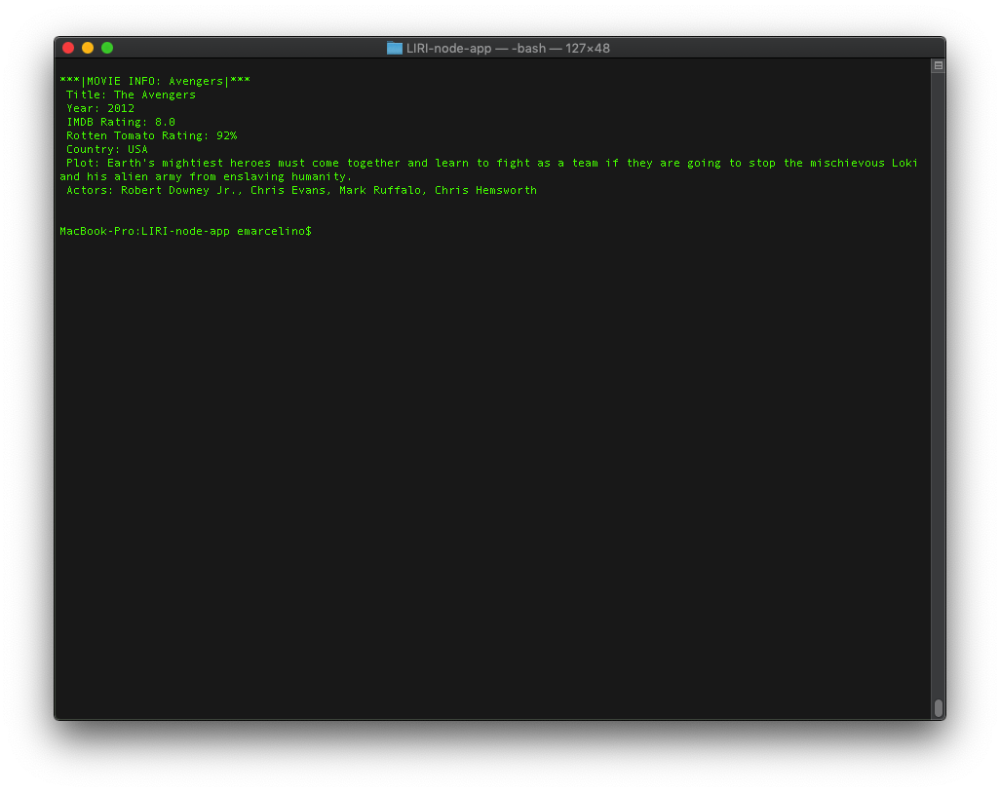
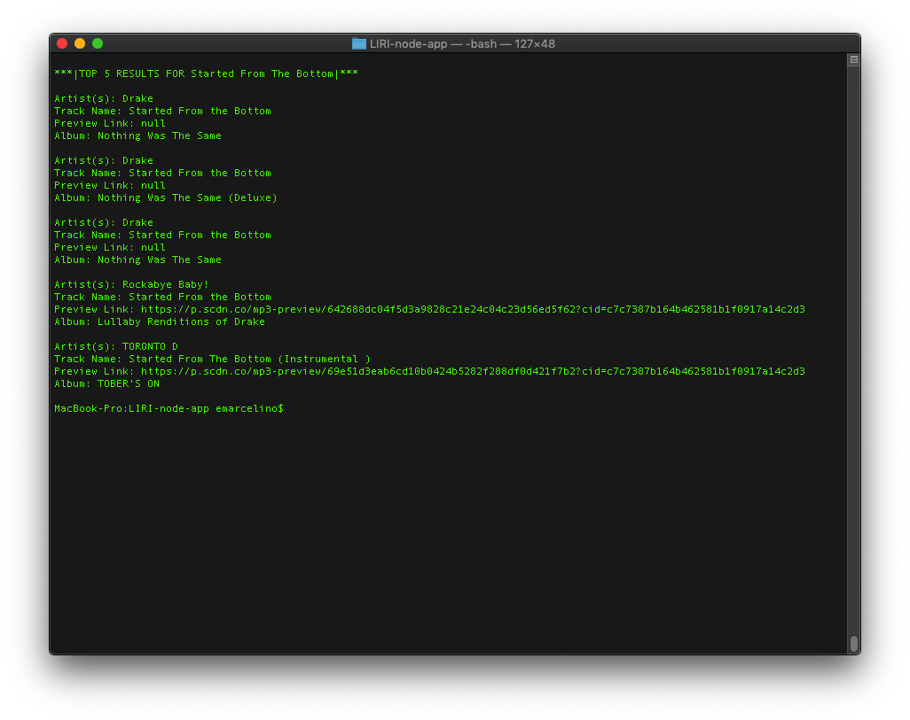

# LIRI-node-app

## Installation/Setup
* Clone Repo Locally
* run 'npm install' to install dependancies
* create a file named '.env' with the following text inside, replace [API ID] and [API SEC KEY] with keys provided from Spotify API Account.

  ```
  # Spotify API keys

  SPOTIFY_ID=[API ID]
  SPOTIFY_SECRET=[API SEC KEY]
  ```
* Optional: Edit 'random.txt' with a LIRI Command and Query of your choice 

## Instuctions
### CONCERT-THIS // Find concerts in your area for a particular artist.
Example:
```
BASH>># node liri concert-this Eminem
```

Output:


### MOVIE-THIS // Find info about your favorite movie.
Example:
```
BASH>># node liri movie-this Avengers
```

Output:


### SPOTIFY-THIS-SONG // Find info about your song.
Example:
```
BASH>># node liri spotify-this-song "Started From The Bottom"
```

Output:


### DO-WHAT-IT-SAYS // Runs whatever is in the random.txt file.
The 'random.txt' file should contain [one of the commands above],[Query text] (EXAMPLE: movie-this, Terminator).  Then this command will open that file and run the command with the query text.

Example:
```
BASH>># node liri do-what-it-says
```
